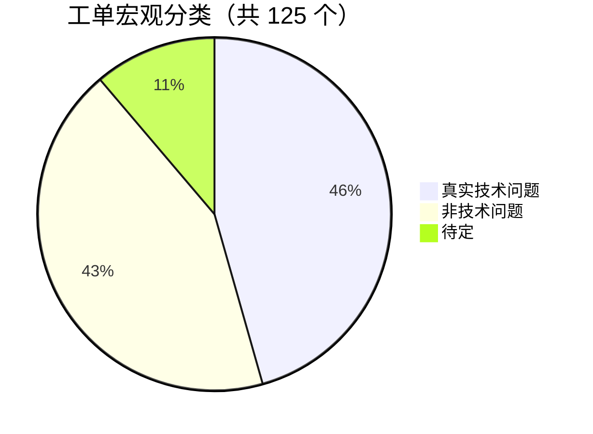
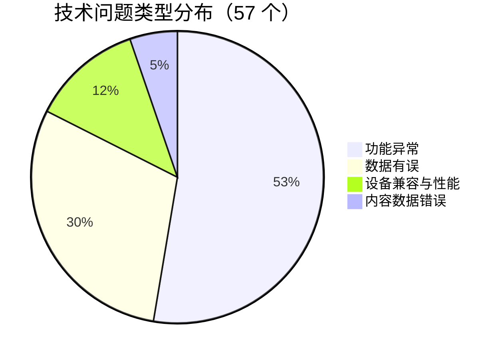
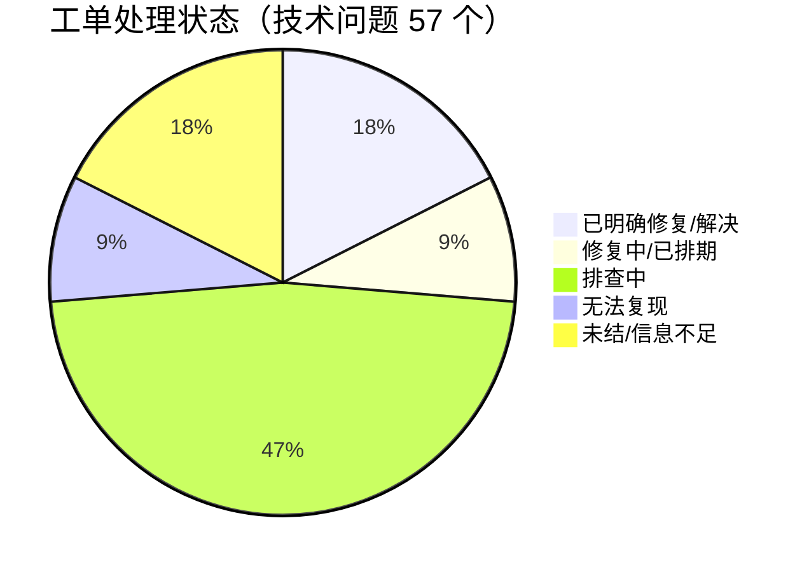
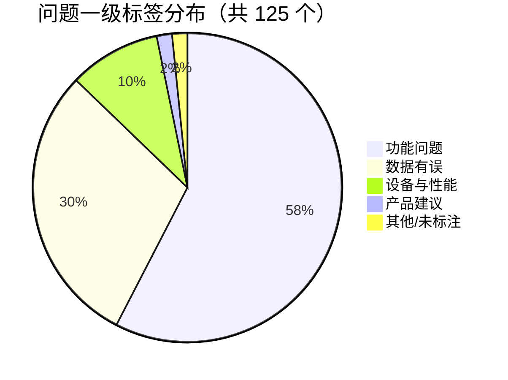

# 📊 飞书工单深度分析报告

**报告日期**: 2026-03-19
**分析周期**: 2026-03-13 至 2026-03-19
**数据来源**: `reports/工单导出_2026-03-13_2026-03-19_含回复.json`
**报告版本**: v2.2

---

## 📊 执行摘要

### 核心数据概览

| 指标 | 本周 | 上周 | 变化 |
|------|------|------|------|
| **总反馈量** | 125 个 | 127 个 | -2 |
| **真实技术问题** | **57 个 (45.6%)** | 47 个 (37.0%) | ↑ **+8.6 个百分点** |
| **非技术问题** | 54 个 (43.2%) | 77 个 (60.6%) | ↓ -17.4 个百分点 |
| **待定** | 14 个 (11.2%) | 3 个 (2.4%) | ↑ +8.8 个百分点 |
| **机器人参与工单** | **86 个 (68.8%)** | 124 个 (97.6%) | ⚠️ **-28.8 个百分点** |
| **机器人排查正确率** | **32.6%**（28/86） | 33.9%（42/124） | -1.3 个百分点 |
| **机器人排查错误率** | **34.9%**（30/86） | 39.5%（49/124） | ↓ -4.6 个百分点 |
| **平均响应时间** | **0.75 小时** | — | — |
| **4 小时内响应率** | **97.6%** | — | — |
| **高优先级 (P1)** | 123 个 (100%) | — | 全部 P1 |

> 📌 注：`statistics` 字段记录总量为 125，JSON items 实际为 123 条，差值 2 条可能为系统过滤，核心统计以 `statistics` 为准。

---

### 🔥 核心发现（3 个关键洞察）

#### 1. 🔥 3 月 16 日「实验室」模块 web 端集中爆发，单日涌入约 19 个同质工单

- **数据支撑**：3 月 16 日（周一）全天共收到 30 个工单（全周峰值，占 24.0%），其中约 19 个集中来自 `学生端(web)` 的「实验室」模块，涉及「关卡无法通关」、「单词/格子点击失效」、「答完不过关」等高度相似的异常现象，来自阜南县亲情高级中学和涟源市行知中学两所学校。
- **深度解读**：
  - **根本原因**：实验室模块（学生端 web 端的趣味学习关卡）疑似在 3 月 16 日存在前端交互逻辑缺陷——学生完成答题后，通关判定机制未被正确触发，导致学生被「锁死」在当前关卡。部分工单还反映「答题格子无法点击」（#299642、#299495），推断为特定浏览器/设备组合下的 CSS 或事件绑定异常。
  - **技术回复原文**：`"@_user_1 没有日志记录"` (#299495)；`"@_user_1 纯前端项目，目前还没做通关的记录存储"` (#299617)——两条回复揭示出两个深层问题：**缺乏日志埋点**导致排查困难；**通关记录未落库**意味着该功能本就处于「裸奔」状态，学生历史进度数据存在**永久丢失风险**。
  - **影响范围**：集中影响**阜南县亲情高级中学**（约 10 例）和**涟源市行知中学**（约 9 例），两校合计占本周全部工单的约 21.6%（27/125），推测两校在 3 月 16 日同步组织了实验室模块课堂使用，属于灰度上线后首次大规模使用暴露。
  - **风险评估**：❗ **高风险** — 通关记录若未存储，则问题修复后历史进度数据将无法追溯，存在**数据永久丢失**风险。若不尽快修复，下周学校继续使用时将再次爆发。
  - **用户原声**：`"建议删了，影响体验，体验感太差了，答对没有自动提交，我又提交不聊卡在界面里，不让我下一体"` (反馈 #300580)；`"太卡了 有的时候点都点不动那个单词 还总是有 bug 明明做完了 也做对了 但就是没通关"` (反馈 #299776)
  - **趋势洞察**：该问题属于**灰度推广后的大规模使用暴露**，随着实验室模块铺量至更多学校，若根因未解决，类似集群爆发将周期性重演。

#### 2. 📉 机器人参与率骤降至 68.8%，较上周下降 28.8 个百分点

- **数据支撑**：上周机器人参与工单 124/127（97.6%），本周仅 86/125（68.8%），环比下降 **28.8 个百分点**（相对降幅 -29.5%）。约 39 个工单未经机器人参与，较上周多出约 37 个「纯人工工单」。
- **深度解读**：
  - **根本原因**：本周工单中大量来自「学生端(web)-实验室」模块（21+ 个），该模块为相对新的功能，机器人的自动排查单提示 `"请升级至最新版本客户端，以查看内容"`，该回复对 web 端用户**完全无效且具有误导性**（web 端无需「升级客户端」），表明机器人排查逻辑尚未覆盖该模块类型，导致大批工单跳过机器人环节直接由人工处理。
  - **技术回复引用**：`"自动排查单 [图片] 请升级至最新版本客户端，以查看内容"` — 该错误回复出现在多个 web 端工单中，属于自动化系统的覆盖盲区。
  - **影响范围**：约 39 个工单（31.2%）未经有效机器人参与，直接增加了客服团队的人工处理压力。
  - **风险评估**：⚠️ **中风险** — 机器人参与率下降不直接等于服务质量下降（本周平均响应时间仍为 0.75 小时），但无效回复误导用户，且随着新模块不断上线，若知识库持续滞后，自动化率将长期低位运行。
  - **趋势洞察**：上周 97.6% 的超高参与率与本周 68.8% 的骤降形成鲜明对比，揭示出**机器人覆盖率强烈依赖工单类型**——每次新功能上线，必须同步更新机器人排查知识库，否则自动化率将随产品复杂度增加而不断下滑。值得注意的是，本周**机器人排查错误率从上周 39.5% 下降至 34.9%（-4.6 个百分点）**，在参与量骤减的背景下，存量参与工单的排查质量反而有所改善，说明机器人对其已覆盖问题类型的判断相对准确，主要短板在于**覆盖广度不足**而非排查逻辑本身。

#### 3. 📊 数据有误类问题占比 30%，「能量值计算」成为本周最高频单一问题

- **数据支撑**：数据有误类工单共 37 个（30.1%），其中能量值计算问题约 10 个、掌握度/正确率计算异常约 6 个、校长看板数据错误约 4 个、教师端报告数据错误约 5 个。
- **深度解读**：
  - **根本原因**：**能量值问题**（反馈 #307802、#307014、#307455 等）大量定性为「非技术问题」——用户不了解「每日 500 能量上限」规则，到达上限后仍反复获得学习奖励但数字不增加，用户理解为 BUG。这揭示出**产品规则未有效告知用户**的设计缺陷。**掌握度/正确率计算**（#306225、#304043）部分仍有真实逻辑漏洞（如「全对显示 85%」），仍在排查中。**校长看板**（#298798）的生均用时为 0 已解决，但数据口径（教师亮屏时长）理解偏差仍持续引发咨询（#305110）。
  - **技术回复原文**：`"非技术问题，当前用户当天已经达到了500能量，已达上限"` (#307802)；`"没问题，当前知识点 AI课、巩固练习、拓展练习 一共获得56能量符合，该知识点外化掌握度和能量不是一一对应的"` (#307455)
  - **影响范围**：能量值相关工单约 10 个，涉及高中学段（高一为主），推测为新学期学生集中使用激励系统时暴露认知盲区。
  - **风险评估**：⚠️ **中风险** — 数据展示歧义（能量上限无明确提示）是可预见的持续骚扰来源，若不优化交互，每周将稳定产生 5-10 个同类工单消耗客服资源。
  - **用户原声**：`"我的平板显示有496个能量，明明没上限，但是却显示今日能量已达上限，怎么办呀？"` (反馈 #307014)；`"能量给错了吧！我在历史中学习上面显示的是63却给我的是15"` (反馈 #307455)
  - **趋势洞察**：能量值工单连续出现（本周 3 月 13 日—18 日均有），且均定性为非技术问题，属于**产品设计导致的可预期高频投诉**，需从交互层面根治。

---

## 一、反馈处理与转化漏斗分析

| 处理环节 | 流程节点 | 数量 | 转化率/占比 | 解读与分析 |
|---------|---------|-----:|----------:|-----------|
| 接收反馈 | 总反馈量 | **125** | 100% | 基准线 |
| 自动排查 | 机器人参与 | **86** | 68.8% | 较上周骤降 29.5%，新模块覆盖缺失 |
| 问题定性 | 真实技术问题 | **57** | 45.6% | 较上周 +8.6 个百分点，web 端集群推动 |
| | 非技术问题 | **54** | 43.2% | 较上周 -17.4 个百分点 |
| | 待定/未结 | **14** | 11.2% | 较上周增 366%，排查难度高 |
| 问题解决 | 已明确修复 | **≈10** | ~8% | 含 8 个已修复 BUG |
| | 修复中/已排期 | **≈5** | ~4% | 含 4 月初修复计划 |
| | 仍在排查 | **≈42** | ~34% | 以实验室模块集群为主 |

**核心瓶颈**：
- **实验室模块工单堆积**：约 19 个 web 端工单尚无明确技术结论（大量以「辛苦看下这个问题」结尾），成为本周最大未结工单池。
- **机器人覆盖断层**：机器人对 web 端实验室类问题给出无效响应，降低了自动化效率，增加了人工压力。
- **待定工单激增**：从上周 3 个增至 14 个（+366%），主要来自实验室模块和键盘输入异常，技术侧排查困难。

---

## 二、根本原因分析（Root Cause Analysis）

**分析范围**：已定位的 57 个技术问题中，明确有技术结论的约 15 个，另有约 15 个实验室模块集群问题根因高度相似。

| 问题现象 / 用户原文 | QA 最终定位结论 | 问题归类 | 可归纳的改进方向 | 工单 ID |
|------------------|--------------|--------|----------------|--------|
| `1.1.4 的视频消失了只剩巩固练习了` | 已修复 | **功能异常/发版引入** | 增加发版前回归测试覆盖 | #306301 |
| `学情-一键催收报错，也没有添加任务的地方` | 今天会修复 | **功能异常/接口错误** | 学情新功能上线前需完整功能验证 | #305846 |
| `字体自动出现空格` | 已修复 | **前端渲染缺陷** | 输入框内容过滤需加单元测试 | #304463 |
| `键盘卡里面移不出来了` | 已修复 | **前端交互缺陷** | 键盘组件退出逻辑需健壮性测试 | #304626 |
| `那个空格删不掉，自己出的软件还有漏洞` | 该功能已修复 | **前端输入缺陷** | 空格处理统一到底层组件 | #303378 |
| `课堂学情显示没有学生` | 准备跟随最新版课堂学情上线，原因：学生课前进入测验 | **数据上报时序缺陷** | 补充课前学生行为的数据兜底逻辑 | #301455 |
| `校长看板生均用时全部为 0` | 已经解决了 | **数据统计缺陷** | 数据统计任务需加监控告警 | #298798 |
| `英语填空题大题部分答案是对的，系统直接判错` | 题库录入答案错误，已修改为 "lives" | **内容数据错误** | 题库录入需增加 QA 复核流程 | #296888 |
| `顽固分子群组删不掉、也不能修改` | 当前问题已修复上线 | **功能异常/边界条件** | 群组操作异常状态需覆盖测试 | #294417 |
| `导入教师名单，添加成功但系统未生成账号` | 同一手机号多行记录被当同一老师处理，不会新建账号 | **数据处理逻辑缺陷** | 导入失败需明确报错，而非静默忽略 | #294111 |
| `选择解析时根号无法被选中` | 当前根号为 svg 图片，不可被选中 | **产品设计缺陷(已知)** | SVG 内容需支持文本选中或改用可选文本格式 | #305801 |
| `大题写了一部分退出说已保存，重进后被清空` | 下周再看 | **数据持久化缺陷** | ⚠️ 高风险：作答自动保存可靠性待验证 | #301263 |
| `第五关填完了，不过关` | 没有日志记录 | **Web 端通关判定缺陷** | 实验室模块需建立完整日志埋点体系 | #299495 |
| `明明我通关了为啥不给我记录` | 纯前端项目，目前还没做通关的记录存储 | **功能未完成/缺少持久化** | ⚠️ 数据丢失风险：通关记录需补后端存储 | #299617 |
| `倍速播放切换后回归 1 倍速` | 在测试 | **播放器状态管理缺陷** | 播放器参数需跨场景持久化 | #295024 |

### 共性技术短板总结

**1. 前端交互健壮性不足**（7 例，占技术问题 12.3%）
- **表现**：字体空格、键盘卡住、根号无法选中、输入框点击失效等前端交互异常
- **改进**：建立前端组件级交互异常测试用例库，核心输入组件上线前必须覆盖边界条件测试

**2. 新功能/模块缺乏完整日志与数据持久化**（实验室模块集群，≥15 例）
- **表现**：实验室通关无日志记录、通关进度未存储后端，导致问题无法排查、数据永久丢失
- **改进**：新功能上线前，必须完成埋点设计和后端数据存储方案，禁止「纯前端」功能裸跑上线

**3. 数据上报与展示一致性问题**（6 例，含校长看板、掌握度、教师端报告）
- **表现**：校长看板生均用时为 0、课堂学情无学生、掌握度/正确率计算与预期不符
- **改进**：建立数据链路监控（前端上报→后端计算→展示层全链路追踪），关键数据指标设置自动异常告警

---

## 三、问题分类统计

### 宏观分类占比



- **技术问题 45.6%（57 个）**：较上周 37.0% 上升 8.6 个百分点，由 web 端实验室模块集群驱动
- **非技术问题 43.2%（54 个）**：接近一半工单消耗的是产品规则理解和用户沟通成本，而非技术排查成本

### 各分类典型问题

#### 1. 真实技术问题（57 个）

**已明确修复（约 10 个）**：

- 工单 #306301：`"1.1.4 的视频消失了"` → 已修复
- 工单 #304463：`"字体自动出现空格"` → 已修复
- 工单 #304626：`"键盘卡里面移不出来了"` → 已修复
- 工单 #303378：`"那个空格删不掉"` → 该功能已修复
- 工单 #298798：`"校长看板生均用时全部为 0"` → 已经解决
- 工单 #298197：`"学情一键催收报错"` → 明天修复上线
- 工单 #296888：`"英语填空题答案判错"` → 题库答案已修改为 "lives"
- 工单 #294417：`"顽固分子群组无法编辑"` → 已修复上线
- 工单 #292753：`"题目乱码"` → 题干已修改
- 工单 #294111：`"导入教师账号未生成"` → 重复手机号处理逻辑已说明

**仍在排查/待修复（约 47 个）**：

- **Web 端实验室关卡异常集群（约 15 个）**——仍在排查，缺乏日志 ⚠️
- 课堂学情无学生 (#301455)——4 月初随新版本修复
- 大题作答自动保存丢失 (#301263, #300233)——下周跟进 ⚠️
- 倍速播放回归 1 倍速 (#295024)——测试中
- 键盘语法输入消失 (#304798)——待排查
- 学生正确率显示错误 (#306225, #304043)——排查中
- 校长看板数据展示错误 (#306481, #299641)——排查中

#### 2. 非技术问题（54 个）

**用户理解偏差（约 23 个，42.6%）**：

- Top 1：**能量值达到上限**（约 10 个）→ 回复：`"非技术问题，当前用户当天已经达到了500能量，已达上限"`
- Top 2：**任务完成后无法订正**（约 5 个）→ 回复：`"非技术问题，学生端提交完成后一直都是无法订正的，只能查看报告"`
- Top 3：**课程进度数据延迟**（约 3 个）→ 回复：`"这些数据都存在一定的延迟，建议老师刷新重进看一下"`
- **任务时间筛选误操作**（约 3 个）→ 回复：`"是通过任务开始时间筛选的，可以点击右上角时间筛选未来的时间段"`

**网络/环境问题（约 4 个，7.4%）**：

- `"视频卡顿"` → 回复：`"日志显示用户本地丢包率高，建议切换4G/Wifi"`
- `"无配图，图片加载失败"` → 回复：`"学生网络问题，可以点击重新加载"`

**产品规则/设计如此（约 13 个，24.1%）**：

- `"答题卡作业学生无法订正"` → 符合产品设计（仅教师端可批改）
- `"校长看板时长数据显著异常"` → 回复：`"时长统计的是教师电脑和平板端亮屏期间所有时长"`
- `"被删除的资源学生端仍可看到"` → 符合留痕设计

**图片/内容加载（约 4 个，7.4%）**：图片因网络未加载，学生误以为题目缺少配图

---

## 四、真实技术问题方向分析

### 技术方向分布



### 各方向典型问题

#### 功能异常（约 30 个）

**⚠️ 学生端(web) - 实验室模块（约 15 个）— 最高优先级集群**

- **工单 #299372~#299814**（8+ 个，集中于 2026-03-16）：学生完成关卡答题后无法通关；单词/格子无法点击；键盘遮挡输入区域。来自阜南县亲情高级中学、涟源市行知中学两所学校，高度同质，属同一根因。

**学生端(app) - 输入/提交功能（4 个）**

- 工单 #301263：`"大题写了一部分退出后全部清空"` → ⚠️ **数据丢失高风险**，下周跟进
- 工单 #300449：`"图片上传失败"` → 未复现，学生已自行纠正
- 工单 #296666：`"错题加不到错题本里"` → 仍在跟进
- 工单 #295024：`"倍速切换后回归 1 倍速"` → 测试中

**运营端 - 学情/任务功能（2 个）**

- 工单 #298197 / #305846：`"一键催收功能报错"` → 已修复上线（来自不同学校的 2 例）

#### 数据有误（约 17 个）

**校长看板数据（4 个）**

- 工单 #298798：校长看板生均用时为 0 → **已解决**
- 工单 #306481：校长看板数据不准确 → 仍在排查（缺少更多信息）
- 工单 #299641：校长看板布置课时有数据但用时为 0 → 排查中
- 工单 #298169：校长导出数据缺少班级 → 正式身份后 3/16 以后才有数据

**掌握度/正确率计算（5 个）**

- 工单 #306225：全对显示 85% 正确率 → 排查中（`"问一下学生姓名、章节"`）
- 工单 #304043：按正确率排序实际乱序 → 未明确结论
- 工单 #296888：英语填空答案判错 → **已修复**（题库答案录入错误）

**教师端报告/课堂学情（5 个）**

- 工单 #301455：课堂学情无学生 → **4 月初随新版课堂学情修复**
- 工单 #301271：老师报告显示学生学习其他学科 → 排查中
- 工单 #296193：转班后旧班仍显示该学生 → 转班后学生刷新即可同步

#### 设备兼容与性能（约 7 个）

- 工单 #304463：字体自动出现空格 → **已修复**
- 工单 #304626：键盘卡在界面 → **已修复**
- 工单 #303378：答案空格无法删除 → **已修复**
- 工单 #305801：根号 svg 无法选中 → 已知设计问题
- 工单 #303436：练习题键盘卡顿严重 → 已回退，观察线上反馈

---

## 五、问题处理状态分析

### 处理状态分布



### 各状态典型工单

#### ✅ 已明确修复（约 10 个，17.5%）

- 工单 #306301：教师端视频消失 → 当日修复
- 工单 #294417：顽固分子群组异常 → 修复上线
- 工单 #298798：校长看板数据为 0 → 已解决
- 工单 #304463 / #303378：字体空格问题 → 已修复

#### ⏰ 修复中/已排期（约 5 个，8.8%）

- 工单 #301455：课堂学情 → **4 月初随新版上线**
- 工单 #295024：倍速问题 → **测试中**
- 工单 #298197：一键催收 → **已修复上线**

#### 🔴 挂起/待定工单（约 14 个，24.6%）⚠️

- **工单 #301263**：`"大题退出后清空"` → 下周跟进（⚠️ **数据丢失风险**）
- **Web 端实验室集群（约 15 个）**：大量回复停留在「辛苦看下这个问题」，无明确结论
- **工单 #304798**：键盘语法输入异常 → `"那就奇怪了，我们下来再反查下"`

---

## 六、关键维度分析

### 6.1 每日工单量趋势

| 日期 | 工单量 | 占比 | 特征 |
|------|-------:|-----:|------|
| 2026-03-13（周五） | 11 | 8.8% | 周内正常水平 |
| 2026-03-14（周六） | 5 | 4.0% | 周末低谷 |
| 2026-03-15（周日） | 5 | 4.0% | 周末低谷 |
| **2026-03-16（周一）** | **30** | **24.0%** | 🔥 全周峰值，实验室模块集中爆发 |
| 2026-03-17（周二） | 20 | 16.0% | 仍有余波 |
| 2026-03-18（周三） | 27 | 21.6% | 二次高峰（含视频消失、催收报错等） |
| 其他/无时间戳 | ≈27 | 21.6% | 含跨期工单 |

**趋势洞察**：

- 🔥 **周一效应显著**：3 月 16 日（周一）工单量是周末的 6 倍，学生开学使用新模块（实验室）集中爆发
- 📊 **3 月 18 日二次高峰**：转向教师端/运营端功能异常（视频消失、催收报错、能量值等多类问题并发）
- 📉 **周末低谷规律**：14-15 日工单量约为工作日的 1/4，与学生使用规律高度吻合

### 6.2 客户端分布

| 客户端 | 工单数 | 占比 | TOP 问题 | 已修复数 |
|--------|-------:|-----:|---------|--------:|
| **学生端(app)** | 54 | 43.9% | 功能异常、数据有误 | 3 |
| **运营端** | 29 | 23.6% | 校长看板、任务布置 | 3 |
| **学生端(web)** | 21 | 17.1% | 实验室模块关卡异常 | 1 |
| **教师端(web)** | 11 | 8.9% | 教师端报告、课堂学情 | 2 |
| **教师端(pad)** | 7 | 5.7% | 视频消失、任务布置 | 2 |
| **教师端(wechat)** | 1 | 0.8% | 其他 | 0 |

> ⚠️ 学生端(web) 以 17.1% 的工单量承载了几乎全部实验室模块问题，但修复率极低（仅 1/21），是本周**处理效率最低**的客户端

### 6.3 学校分布 TOP 5

| 学校名称 | 工单数 | 占比 | 主要问题类型 | 是否集中爆发 |
|---------|-------:|-----:|------------|:----------:|
| **阜南县亲情高级中学** | **15** | **12.2%** | Web 端实验室关卡异常、学习数据 | **是（3/16）** |
| **涟源市行知中学** | **12** | **9.8%** | Web 端实验室关卡异常、提交异常 | **是（3/16）** |
| 夏邑县第三高级中学 | 4 | 3.2% | 能量值、功能异常 | 否 |
| 湖州市南太湖双语学校(高中部) | 4 | 3.2% | 教师报告、学情 | 否 |
| 曲靖长水高级中学 | 3 | 2.4% | 各类问题 | 否 |

**深度解读**：

- **阜南 + 涟源两校贡献了 21.6%（27/125）的工单**，且绝大部分集中在 3 月 16 日，高度指向同一功能（实验室模块）的同一次课堂活动
- 两校可能在 3 月 16 日同步组织了实验室模块的首次课堂使用，属于**灰度推广的首批大规模用户**
- **建议**：将这两所学校作为后续实验室模块修复验证的**重点回访对象**，在下次组织使用前确认问题已修复

### 6.4 一级标签分布



### 6.5 时间分布（按小时）

| 时段 | 工单数 | 特征 |
|------|-------:|------|
| 08:00—12:00 | 28（22.8%） | 上午上课前 |
| 12:00—14:00 | 6（4.9%） | 午休低谷 |
| **14:00—18:00** | **31（25.2%）** | **下午上课高峰** |
| **18:00—21:00** | **27（22.0%）** | **🔥 晚自习高峰** |
| 06:00—08:00 | 1（0.8%） | 极少 |

**峰值时段**：14:00—21:00 合计占 47.2%，与学生下午上课及晚自习时间高度吻合

---

## 七、趋势与预警

### 7.1 重复性问题识别

#### 🔴 高频问题（≥5 次）

**1. Web 端实验室关卡无法通关/点击失效**（约 15 次）

- **状态**：根本原因尚未明确，缺少日志排查依据
- **建议**：紧急补充实验室模块前端日志埋点（点击事件、通关判定触发），立即排查通关判定逻辑；**同时补充通关数据的后端持久化，防止历史数据永久丢失**

**2. 能量值达上限被误报为 BUG**（约 10 次）

- **状态**：产品规则如此，但用户感知为故障
- **建议**：当用户今日能量接近/达到 500 上限时，**在能量条旁增加「今日能量已达上限」的明显提示**；若获得奖励但无法添加，弹窗说明「今日上限已满，明天继续收集」

**3. 校长看板/教师端报告数据疑似错误**（约 8 次）

- **状态**：部分属产品逻辑不清晰（时长统计口径），部分为真实 BUG（生均用时为 0 已修复）
- **建议**：为校长看板关键指标增加「?」说明按钮，点击后展示指标计算口径说明，降低歧义引发的工单量

#### 🟡 中频问题（2—4 次）

1. **学生作答后提交/保存异常**（3 次，#301263、#300233、#300580）— ⚠️ 数据丢失风险，需优先跟进
2. **掌握度/正确率计算异常**（3 次，#306225、#304043、#296888）— 1 例已修复，2 例仍在排查
3. **一键催收功能报错**（2 次，#298197、#305846）— 已修复，持续观察
4. **倍速播放回归 1 倍速**（1 次，#295024）— 测试中，关注测试结果

### 7.2 风险预警

#### ❗ 高风险预警

**1. 学生大题作答数据丢失隐患**

- **描述**：工单 #301263 反馈「大题写了一部分退出，系统提示已保存进度，但重进后大题被清空」，目前结论为「下周再看」。
- **数据支撑**：同类问题在 #300233 中也有出现（`"写到一半退出去后全没了，要重新写"`）
- **潜在影响**：若大题自动保存存在可靠性问题，学生测验/作业数据可能**静默丢失**，直接影响学习记录完整性和教师批改公平性
- **行动**：⚡ 本周内完成作答自动保存功能的可靠性验证（重点测试：后台切换、网络中断场景）

**2. 实验室模块无日志、通关无记录——功能「裸跑」**

- **描述**：客服排查关卡问题时被告知「没有日志记录」；通关记录「纯前端项目，目前没做存储」。
- **数据支撑**：约 15 个工单无法被技术侧有效排查（已超 7 天），占本周技术问题的 26%
- **潜在影响**：随着实验室模块铺量，问题将无法追溯，学生完成数据无法统计，产品价值无法量化
- **行动**：⚡ 本周内完成：① 关键操作日志补充（点击、提交、通关）；② 通关记录后端存储接口开发

#### ⚠️ 中风险预警

**3. 机器人排查覆盖盲区——新模块缺失对应知识库**

- **描述**：机器人对 web 端学生的自动回复为「请升级至最新版本客户端」，该回复对 web 用户无效且具有误导性
- **数据支撑**：约 21 个 web 端工单经机器人处理后仍需人工介入，机器人无效参与率显著
- **行动**：🔧 在机器人知识库中增加「学生端(web)」和「实验室模块」的识别分支，替换无效回复逻辑

#### 🟢 低风险提示

**4. 课堂学情修复排期较长（4 月初）**

- 工单 #301455 课堂学情无学生问题排期到 4 月初修复，时间跨度约 3 周，期间可能持续收到类似工单
- 建议提前准备标准回复话术，并在工单系统中标注「已知问题，4 月初修复」

### 7.3 问题演化趋势

```
本周技术问题演化趋势（3/13 → 3/18）：

3/13: 散点型工单（11 个），以能量值、数据有误为主
      ↓
3/16: 🔥 实验室模块集群爆发（30 个峰值），新模块首次大规模使用暴露根本缺陷
      ↓
3/17: 余波期（20 个），部分为 3/16 未解决问题的跟进
      ↓
3/18: 二次高峰（27 个），转向教师端/运营端功能异常（视频消失、催收报错等）

⚠️ 趋势判断：实验室模块问题已进入「排查期」，若本周无法明确根因并修复，
下周学校继续使用时将再次爆发，且规模可能更大。
```

---

## 八、附录：关键指标汇总

| 指标 | 数值 | 目标 | 达成情况 | 说明 |
|------|------|------|:-------:|------|
| **工单解决率**（技术问题） | ~17.5%（10/57） | ≥50% | ⚠️ | 实验室集群大量未结，拉低整体解决率 |
| **平均响应时间** | **0.75 小时** | ≤4 小时 | ✅ | 优秀，97.6% 工单在 4 小时内首次响应 |
| **真实 BUG 率** | **45.6%** | ≤40% | ⚠️ | 较上周 +8.6 个百分点，由 web 端实验室问题驱动 |
| **机器人参与率** | **68.8%** | ≥90% | ⚠️ | 骤降 28.8 个百分点，新模块覆盖缺失 |
| **机器人排查正确率** | **32.6%**（28/86） | — | 📌 | 较上周 33.9% 小幅下降 1.3 个百分点 |
| **机器人排查错误率** | **34.9%**（30/86） | — | 📌 | 较上周 39.5% 改善 4.6 个百分点，覆盖存量问题质量提升 |
| **重复问题率** | ≥22%（估算） | ≤20% | ⚠️ | 能量值高频重复 + 实验室集群 |
| **高优先级 P0/P1** | 123 个（100% P1） | — | 📌 | 全部 P1，无 P0，响应效率良好 |

**数据处理说明**：

- 去重规则：以 `_id` 字段作为唯一标识，不做跨文件去重
- 定性标准：以 `ext.issueType` 字段为准（基于回复中的最终结论）
- 统计来源：`statistics.current` 字段（官方统计 125 个）与 JSON items（123 条）存在 2 个差异，核心统计以 `statistics` 字段为准
- 数据来源：`reports/工单导出_2026-03-13_2026-03-19_含回复.json`

---

## 📌 总结

### 周度亮点

- ✅ **响应极速**：平均响应时间仅 0.75 小时，97.6% 的工单在 4 小时内获得首次回复，远超 ≤4 小时目标，体现了客服团队的高效运作
- ✅ **快速止损（多例 BUG 当日修复）**：本周约 10 个技术 BUG 明确修复，其中「键盘卡住」（#304626）、「一键催收报错」（#298197）等核心功能异常均在当日或次日完成修复，有效控制问题扩散
- ✅ **非技术问题占比大幅下降**：非技术问题从上周 60.6% 降至 43.2%（降幅 17.4 个百分点），说明客服定性准确性提升或用户群体操作熟练度在提高

### 周度改进点

- ⚠️ **实验室模块技术债务亟待清偿**：约 15 个关卡异常工单累积，根因迟迟无结论（缺日志、缺后端存储）。若下周学校继续组织使用，将再次爆发，且历史学生完成数据存在永久丢失风险。**建议本周内完成日志补充和通关记录存储**
- ⚠️ **机器人知识库更新严重滞后于产品迭代**：机器人参与率骤降 28.8 个百分点，且对 web 端用户给出错误提示（「请升级客户端」）。每次新功能/模块上线，必须**同步更新机器人排查知识库**，否则自动化率将随产品复杂度增加而持续下滑
- ⚠️ **高频非技术工单（能量值）需从产品层根治**：能量值达上限被持续误报为 BUG（约 10 次/周），是完全可预测的噪音工单。通过一个简单的 UI 提示（能量条达上限时显示「今日已满」）即可消除，建议排期为 P2 优化尽快上线

---

*报告生成时间：2026-03-19 | 分析工具：自动化脚本 + 人工深度解读*
*数据来源：飞书工单系统导出 | 遵循《工单深度分析工作流规范 v2.2》*
