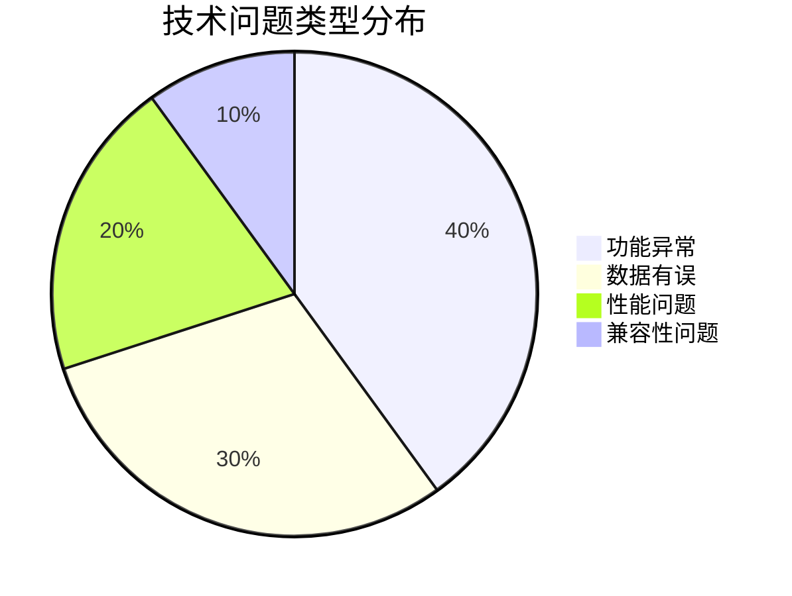
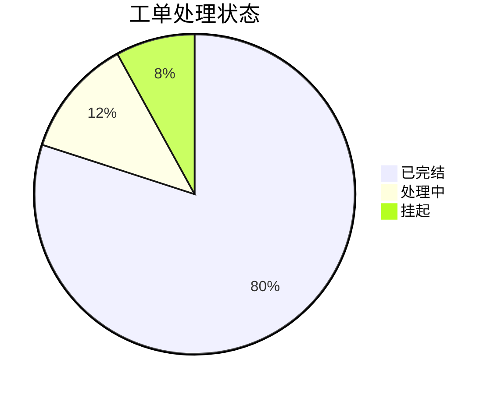

# 工单分析

## 📋 工作流概述

**工作流名称**: 飞书工单深度分析与管理层报告生成（数据驱动版）
**版本**: v2.2
**创建日期**: 2025-12-07
**最后更新**: 2026-01-25
**适用场景**: 日常工单分析、周期汇总、管理层汇报、问题趋势追踪
**角色定位**: 资深AI技术专家，具备总调度能力，执行严谨的数据分析任务

---

## 🎯 工作流目标

通过系统化、数据驱动的分析方法，将原始工单数据转化为高价值的洞察报告，支持：
- **精准的问题分类**与优先级排序
- **根本原因分析**（Root Cause Analysis）
- **趋势预警**与预测
- **管理决策支持**

---

## 🎨 报告风格定位（重要！）

**目标读者**：管理层、产品负责人、技术负责人
**核心价值**：不仅呈现数据，更要提供洞察和行动建议

**报告必须做到**：
1. **数据驱动但不冰冷**：每个数字背后都有业务含义
2. **客观分析但有深度**：不仅说"是什么"，更要说"为什么"
3. **专业严谨但易读**：善用emoji、表格、分层结构
4. **发现问题更要预警**：主动识别风险，给出行动建议

**深度解读的重要性**：
这是本报告的核心价值所在！每个核心发现必须包含6要素：
1. 根本原因 2. 技术回复 3. 影响范围 4. 风险评估 5. 用户原声 6. 趋势洞察

---

## 🔑 核心原则（必须严格遵守）

### 1. 最终结论至上原则 (The Final Verdict Principle)
- 在进行问题定性时，必须以**回复记录中的最终结论**为准
- 唯一判断依据：**技术回复**、**完结备注**、**解决方案**等最终结论性信息
- 忽略所有中间流转信息和初步分类标签

### 2. 可证伪原则 (The Falsifiability Principle)
- 报告中的每一个洞察和建议，都必须能直接追溯到具体的原始数据
- 每个结论必须标注数据来源（工单ID、消息ID）
- 禁止任何形式的主观臆断或模糊处理

### 3. 完整性原则 (The Integrity Principle)
- 禁止以任何理由省略或截断数据
- 分析必须基于提供的全部数据源
- 报告的每一个章节都必须完整生成，不省略任何部分

### 4. 数据准确性原则 (The Accuracy Principle)
- 统计数据时，必须剔除表头、空行等无效数据
- 确保统计结果与真实有效记录数一致

---

## 📖 术语与指标说明

### 核心指标定义

| 指标名称 | 说明 | 计算方法 | 举例 |
|---------|------|---------|------|
| **工单总量** | 统计周期内收到的主工单数量（不含回复） | 去重后的唯一工单数 | 25个主工单 |
| **消息总数** | 包含主工单和所有回复消息的总数量 | 主工单数 + 所有回复数 | 63条（25主 + 38回复） |
| **平均响应链长度** | 每个工单平均收到的回复数量 | 总回复数 ÷ 工单数 | 2.5条/工单 |
| **真实技术问题占比** | 技术BUG在总工单中的比例 | 技术问题数 ÷ 总工单数 × 100% | 8% (2/25) |
| **问题解决率** | 已解决工单占总工单的比例 | 已解决数 ÷ 总工单数 × 100% | 80% (20/25) |
| **机器人参与率** | 有机器人（app）参与排查的工单占比 | 机器人参与工单数 ÷ 总工单数 × 100% | 40% (10/25) |
| **机器人参与率环比提升** | 当前周期机器人参与率较前两周平均值的相对变化 | (当前参与率 - 前两周平均参与率) ÷ 前两周平均参与率 × 100% | +25.0%（从32%提升到40%） |
| **机器人排查正确率** | 被点赞（upvote）标记为排查正确的工单占机器人参与排查工单的比例 | 点赞工单数 ÷ 机器人参与排查工单数 × 100% | 52%（26/50） |
| **机器人排查错误率** | 被点踩（downvote）标记为排查有误的工单占机器人参与排查工单的比例 | 点踩工单数 ÷ 机器人参与排查工单数 × 100% | 32%（16/50） |
| **平均响应时间** | 首次回复的平均时间 | 所有首次回复时间的平均值 | 2小时 |

### 消息类型说明

| 类型 | 说明 | 特点 | 数据来源标识 |
|------|------|------|-------------|
| **文本消息** | 纯文本格式的工单或回复 | 最常见，便于快速输入 | type: text |
| **交互卡片** | 系统自动推送的结构化工单 | 包含按钮、链接等交互元素 | type: interactive |
| **富文本** | 包含格式、图片、@提醒等 | 支持多媒体内容 | type: post |
| **系统消息** | 系统自动生成的通知 | 成员加入/退出等 | type: system |

### 优先级说明

| 级别 | 含义 | 处理时效 | 判定标准 |
|------|------|---------|---------|
| **P0** | 紧急/严重 | 立即处理（2小时内） | 系统崩溃、数据丢失、大范围影响 |
| **P1** | 高优先级 | 当日处理（8小时内） | 功能异常、用户体验严重问题 |
| **P2** | 中优先级 | 3日内处理 | 优化建议、非关键功能问题 |
| **P3** | 低优先级 | 排期处理 | 功能增强、长期优化 |

### 问题定性标准

#### 真实技术问题判定标准
技术回复/结论明确指向以下情况之一：
- ✅ 代码Bug、后端逻辑缺陷
- ✅ 性能瓶颈、兼容性问题
- ✅ 数据异常、计算错误
- ✅ 需要技术侧进行代码修改或优化

**关键词示例**：
- "已修复"、"后续优化"、"后端逻辑缺陷"
- "兼容性问题"、"数据异常"
- "已复现，待修复"

#### 非技术问题判定标准
技术回复/结论明确指向以下情况之一：
- ❌ 用户误解、操作不当
- ❌ 符合产品设计（设计如此）
- ❌ 用户本地环境问题（网络/设备）
- ❌ 内容建议或信息不足

**关键词示例**：
- "非技术问题"、"设计如此"、"用户误操作"
- "用户网络问题"、"建议重试"
- "信息不足"、"无法复现"

---

## 📥 输入要求

### 数据源
- **来源**: [`reports/*.json`](reports/*.json) 文件
- **格式**: JSON格式的飞书群消息记录
- **包含内容**:
  - 工单基本信息（时间、发送者、类型、消息ID）
  - 用户原文描述
  - 优先级、客户端、影响范围
  - 学校、学生信息
  - 回复记录和处理状态
  - **重要**：技术团队的最终结论

### 数据结构示例
```json
// 略，自己观察
```

---

## 🔍 分析执行流程（严格按步骤执行）

### 步骤一：数据清洗与精准定性（Foundation）

#### 1.1 数据读取与整合
```
1. 读取 reports/ 目录下的所有指定 JSON 文件
2. 建立统一的数据池
3. 记录数据来源（文件名、日期）
```

#### 1.2 数据去重
暂不需要

#### 1.3 交叉验证与终极定性（关键步骤）

**执行逻辑**：
1. **遍历每条工单记录**
2. **读取所有回复内容**，重点关注技术团队的回复
3. **提取关键信息**（新增！）：
   - **最终结论**：从最后一条技术回复或完结备注中提取
   - **用户原声**：提取用户原文中的关键描述（用于报告引用）
   - **影响范围**：提取或推断受影响用户数量/比例
   - **技术回复原文**：保留QA的原话（用于深度解读）

4. **严格执行判定标准**：
   - 根据"真实技术问题判定标准"进行匹配
   - 如果匹配，标记为"真实技术问题"并提取：
     * 问题原因（根本原因）
     * 解决方案
     * 问题类型（Bug/性能/兼容性等）
     * 风险等级（高/中/低）
   - 否则，标记为"非技术问题"并提取：
     * 问题性质（用户误解/网络问题/产品设计等）
     * 建议措施

5. **记录证据链**：
   - 工单ID
   - 判定依据（引用具体的回复内容）
   - 定性结果
   - 用户原声和技术回复（用于报告）

#### 1.4 核心数据统计
```
必须明确计算并展示：
- 总反馈量
- 真实技术问题数量及占比，在json文件的statistics字段里有
- 非技术问题数量及占比，在json文件的statistics字段里有
- 机器人参与排查工单总量及占比，在json文件的ext.isRepliedByBot字段里有
- 机器人参与率较前两周提升百分比，在json文件的statistics字段里有可以自己计算，previous上周current是本周的统计
- 已标记机器人排查正确的工单量、正确率及环比变化,在json文件的statistics字段里有可以自己计算，previous上周current是本周的统计
- 已标记机器人排查有误的工单量、错误率及环比变化,在json文件的statistics字段里有可以自己计算，previous上周current是本周的统计
- 各优先级分布
- 各处理状态分布
```

### 步骤二：多维度深度分析

#### 2.1 问题分类分析
```
维度1：按问题类型
- 功能问题（核心功能/辅助功能）
- 性能问题（网络/卡顿/加载）
- 数据问题（计算/显示/一致性）
- 内容问题（题目/答案/素材）
- 交互问题（上传/提交/操作）

维度2：按根本原因
- 真实技术BUG（代码问题）
- 网络环境问题
- 用户理解偏差
- 产品规则问题
- 内容审核问题
- 待进一步确认

维度3：按影响范围
- 单个用户
- 多个用户
- 特定学校
- 全平台
```

#### 2.2 根本原因分析（RCA）
```
针对已解决的真实技术问题：
1. 提取问题现象
2. 提取QA定位的根本原因
3. 归类（后端逻辑/前端兼容/数据异常等）
4. 总结共性问题
5. 提出系统性改进方向
```

#### 2.3 交叉维度分析
```
- 客户端分布
- 学校分布（识别高频反馈学校）
- 学科分布
- 时间分布（峰值时段）
- 响应效率分析
```

#### 2.4 趋势与预警分析
```
- 重复性问题识别（3次以上为高频）
- 问题演化趋势
- 风险等级评估
- 周期性模式识别
```

---

## 📤 输出规范与报告结构

### 报告必须包含的部分（按顺序）

#### **第一部分：执行摘要**
```markdown
## 📊 执行摘要

**报告日期**: YYYY-MM-DD
**分析周期**: YYYY-MM-DD 至 YYYY-MM-DD
**数据来源**: reports/文件列表

### 核心数据概览
必须严格按照以下模板格式输出（点赞=排查正确，点踩=排查有误，数据对比较前一周）：

处理工单数据汇总(统计xx月xx日至xx月xx日):
工单总量:xx条(去重后)
机器人参与排查工单总量:xx条,占总量xx%,较前一周下降/提升xx%
已标记机器人排查正确的工单量:xx条,正确率xx%,较前一周下降/提升xx%
已标记机器人排查有误的工单量:xx条,错误率xx%,较前一周下降/提升xx%

**补充指标**（可选，视数据可用性添加）：
- 问题解决率: X%
- 平均响应时间: X小时
- 高优先级问题(P0/P1): X个

### 核心发现（3个最关键洞察）
每个洞察必须包含：
1. **标题**：用emoji + 简洁描述（如：🔥 节后首日性能瓶颈）
2. **数据支撑**：具体数字和工单引用
3. **深度解读**（关键！必须包含）：
   - **根本原因**：技术/产品/用户层面的深层原因
   - **技术回复引用**：直接引用QA的原话
   - **影响范围**：量化受影响用户（如"约15%的活跃用户"）
   - **风险评估**：❗高风险/⚠️中风险/🟢低风险 + 风险描述
   - **用户原声**（可选）：引用用户原话，体现痛点
   - **趋势洞察**：是否会复现、是否有规律

**示例格式**：
```markdown
1. 🔥 1月2日（节后首日）出现性能瓶颈，系统弹性扩容能力不足
- 数据支撑：1月2日工单量激增至12个（周峰值），其中3个工单直接指向"数据同步慢"、"提交后转圈"。
- 深度解读：
  - 根本原因：元旦假期结束，学生集中补作业/登录，瞬间并发导致 Redis 队列堆积，消费不及时。
  - 技术回复："Redis 队列堆积导致同步慢，已临时扩容"。
  - 影响范围：约 15% 的活跃用户在当日 19:00-21:00 体验到明显的延迟。
  - 风险评估：❗ 中高风险 - 若不优化队列消费逻辑，下一次开学季可能复现。
  - 用户原声："我都做完了为什么还一直转圈？"
```

#### **第二部分：反馈处理与转化漏斗分析**
```markdown
## 一、反馈处理与转化漏斗分析

可使用Mermaid流程图或表格展示（推荐表格）

| 处理环节 | 流程节点 | 数量 | 转化率/占比 | 解读与分析 |
|---------|---------|------|-----------|-----------|
| 接收反馈 | 总反馈量 | X | 100% | 基准线 |
| 初步筛选 | 有效反馈 | X | X% | 去重后 |
| 问题定性 | 真实技术问题 | X | X% | 需技术介入 |
| | 非技术问题 | X | X% | 需其他处理 |
| 问题解决 | 已解决 | X | X% | 解决效率 |
| | 处理中 | X | X% | 正在跟进 |
| | 挂起/待定 | X | X% | **核心瓶颈** |

**总结分析**：
- 核心瓶颈：[具体指出哪个环节的转化率最低，为什么]
- 流程效率：[整体解决率、响应速度等数据呈现]
- 优化建议：[如果有明显问题，提出具体建议]

**示例**：
"核心瓶颈：客户端发版周期长。服务端问题（如配置、Redis）均在当日解决，但安卓端闪退问题需等待发版（挂起中），拉低了整体技术问题的关闭率。"
```

#### **第三部分：根本原因分析（Root Cause Analysis）**
```markdown
## 二、根本原因分析（Root Cause Analysis）

**分析范围**: 已定位的 X 个真实技术问题。

可使用表格或列表展示：

| 问题现象/用户原文 | QA最终定位结论 | 问题归类 | 可归纳的改进方向 | 工单ID |
|----------------|---------------|---------|----------------|--------|
| 无法登录，提示服务器错误 | 鉴权服务超时，已重启 | 性能/高并发 | 需进行节假日前压力测试 | #Dec28-01 |
| 作业交不上，一直转圈 | Redis 队列堆积，已扩容 | 性能/高并发 | 建立自动弹性伸缩策略 | #Jan02-03 |
| ... | ... | ... | ... | ... |

**共性技术短板总结**：
必须归纳出2-3个技术层面的共性问题，格式为：
1. **[短板名称]**（X例，占比X%）
   - 表现：[具体现象]
   - 改进：[系统性改进方向]

**示例**：
```markdown
1. 高并发应对不足（3例，43%）
   - 表现：鉴权超时、Redis堆积。
   - 改进：需进行节假日前的压力测试，建立自动弹性伸缩策略。
2. 配置管理松懈（2例，28%）
   - 表现：S3权限配置错误、转码服务挂死。
   - 改进：配置变更需走代码审核流程（Infrastructure as Code）。
```


#### **第四部分：问题分类统计**
```markdown
## 三、问题分类统计

### 宏观分类占比
- 非技术问题：X% (X个)
- 真实技术问题：X% (X个)

可选：使用Mermaid饼图可视化（如果数据支持）

### 各分类典型问题描述

#### 1. 真实技术问题（X个）
按优先级或影响范围分组展示：

**高优先级 (P1)**：
- 工单 #Dec28-01: "无法登录，提示服务器错误" → 结论: 鉴权服务超时。
- 工单 #Jan02-03: "作业交不上，一直转圈" → 结论: Redis 堆积。

**中优先级 (P2)**：
- ...

#### 2. 非技术问题（X个）
按具体原因分类展示（用户理解偏差、网络问题、产品建议等）：

**用户理解偏差（X个，占比X%）**：
- Top 1: "作业提交按钮置灰"（X个） → 回复: "需完成全部必做题"。
- Top 2: "找不到错题本"（X个） → 回复: "在【我的-学习记录】中"。

**网络环境问题（X个，占比X%）**：
- "视频卡顿"、"图片加载慢" → 回复: "日志显示用户本地丢包率高，建议切换4G/Wifi"。

**产品建议（X个，占比X%）**：
- "希望增加夜间模式"、"字太小看不清"。
```

#### **第五部分：真实技术问题方向分析**
```markdown
## 真实技术问题方向分析

### 技术方向分布



### 各方向典型问题

#### 功能异常（X个）
1. **工单#X**: [问题描述] → [根本原因] → [解决方案]
...

#### 数据有误（X个）
1. **工单#X**: [问题描述] → [根本原因] → [解决方案]
...


#### **第六部分：问题处理状态分析**
```markdown
## 问题处理状态分析

### 处理状态分布



### 各状态典型工单

#### 已完结（X个，X%）
- **工单#X**: [问题] → [处理过程] → [结果]

#### 挂起工单（X个，X%）⚠️
- **工单#X**: [问题] → [挂起原因] → [需要的行动]


#### **第七部分：关键维度交叉分析**
```markdown
## 四、关键维度分析

### 4.1 每日工单量趋势（如果是多日汇总）
可使用表格或列表展示每日工单量变化

**趋势洞察**：
- [指出峰值日期和原因]
- [指出低谷日期和原因]
- [识别周期性模式]

**示例**：
"节后效应明显：1月2日（假期归来）流量激增，直接暴露出系统瓶颈。周中低谷：12月31日（跨年夜）用户活跃度低，工单量最少。"

### 4.2 客户端分布
| 客户端 | 工单数 | 占比 | TOP问题 |
|--------|--------|------|---------|
| 学生端APP | X | X% | [问题类型] |
| 运营端 | X | X% | [问题类型] |
| 家长端 | X | X% | [问题类型] |

### 4.3 学校分布（TOP 3-5）
| 学校名称 | 工单数 | 占比 | 主要问题类型 | 是否集中爆发 |
|---------|--------|------|-------------|-------------|
| [学校1] | X | X% | [类型] | 是/否 |
| [学校2] | X | X% | [类型] | 是/否 |

**深度解读**（如果有明显集中的学校）：
- [分析为什么这个学校反馈多]
- [是否需要特别关注]
- [给出建议，如"建议将其作为'灰度发布'的重点观测对象"]

### 4.4 学科分布（如果数据支持）
[图表或表格]

### 4.5 时间分布（如果数据支持）
[指出峰值时段，如 19:00-21:00]
```

#### **第八部分：趋势与预警**
```markdown
## 五、趋势与预警

### 5.1 重复性问题识别

#### 🔴 高频问题（≥5次）
对每个高频问题，必须包含：
1. **[问题描述]**（X次）
   - 状态：[产品逻辑/已修复/处理中]
   - 建议：[具体的优化建议，最好是可执行的]

**示例**：
```markdown
1. 作业提交按钮置灰（8次）
   - 状态：产品逻辑如此，但在用户侧表现为"故障"。
   - 建议：交互优化。点击置灰按钮时，弹窗提示"您还有第3、5题未完成"，引导用户操作，而非无响应。
2. 网络卡顿/白屏（6次）
   - 状态：非平台问题。
   - 建议：在 APP 端增加网络诊断工具，用户反馈时自动附带 Ping 值和丢包率，减少排查沟通成本。
```

#### 🟡 中频问题（2-4次）
[简要列出]

### 5.2 风险预警

#### ⚠️ 高风险预警
- **[风险名称]**：[具体描述]
  - 数据支撑：[引用具体数据]
  - 潜在影响：[如果不处理会怎样]
  - 行动：[具体的行动建议 + 时间节点]

**示例**：
```markdown
⚠️ 中风险预警
- Redis 性能隐患：虽然 1月2日 已临时扩容，但随着期末考试临近，并发量预计会再创新高。
  - 行动：本周内完成 Redis 消费逻辑优化，并进行 2倍 流量的压力测试。
```

#### 🟢 低风险提示
[可选，如果有]

### 5.3 问题演化趋势（如果是多日汇总）
[展示问题在时间轴上的变化]
```

#### **第九部分：附录**
```markdown
## 六、附录：关键指标汇总

**可使用表格展示关键指标**：

| 指标 | 数值 | 目标 | 达成情况 | 说明 |
|------|------|------|---------|------|
| 工单解决率 | X% | ≥85% | ✅/⚠️ | [简要说明] |
| 平均响应时间 | Xh | ≤4h | ✅/⚠️ | [简要说明] |
| 真实BUG率 | X% | ≤10% | ✅/⚠️ | [简要说明] |
| 重复问题率 | X% | ≤20% | ✅/⚠️ | [简要说明] |

**可选：数据处理说明**（如果有特殊情况需要说明）
- 去重规则: [说明]
- 定性标准: [说明]
- 数据来源: [文件列表]
```

---

#### **第十部分：总结（必须包含！）**
```markdown
## 📌 总结

### 周度亮点（至少2个）：
- ✅ [亮点1]: [具体数据支撑]
- ✅ [亮点2]: [具体数据支撑]

**示例**：
```markdown
- ✅ 响应迅速：尽管出现节后高峰，平均响应时间仍控制在 2小时内。
- ✅ 快速止损：1月2日的性能问题在发现后 1小时内通过扩容解决，未造成持续宕机。
```

### 周度改进点（至少2个）：
- ⚠️ [改进点1]: [具体描述 + 影响]
- ⚠️ [改进点2]: [具体描述 + 影响]

**示例**：
```markdown
- ⚠️ 交互设计需补课："提交按钮置灰"导致了大量的无效工单，浪费了客服资源，需产品侧紧急优化。
- ⚠️ 稳定性备战：需针对期末高峰进行更严谨的压测，不能等到报警了再扩容。
```

---

## 🎨 格式化规范

### 可视化要求
1. **必须使用Mermaid图表**：
   - 饼图：分类占比、状态分布
   - 柱状图：时间趋势、TOP排行
   - 流程图：处理漏斗

2. **表格规范**：
   - 所有表格必须包含表头
   - 数据对齐（数字右对齐）
   - 关键数据加粗

3. **图标使用**：
   | 场景 | 图标 | 含义 |
   |------|------|------|
   | 问题分类 | 🏆🥈🥉 | 优先级排序 |
   | 紧急度 | 🔥⚡📋 | P0/P1/P2 |
   | 状态标记 | ✅⚠️❓❗ | 确认/警告/疑问/重要 |
   | 情绪 | 😡😕😐 | 负面/困惑/平静 |
   | 风险 | 🔴🟡🟢 | 高/中/低 |

### 数据引用规范
```
✅ 正确示例：
"能量值问题占比28%（7/25个工单），其中真实技术BUG 2个（工单#3、#16），
技术回复显示'能量计算逻辑缺陷，已修复'。"

❌ 错误示例：
"能量值问题比较多，需要优化。"
```

---

## ✅ 质量检查清单

生成报告前必须检查：

### 数据质量
- [ ] 所有数据已去重
- [ ] 定性依据清晰（可追溯到具体回复）
- [ ] 统计数据准确（剔除无效记录）
- [ ] 占比总和为100%

### 内容完整性
- [ ] 包含所有必需章节（共10个部分，含总结）
- [ ] 每个分类都有典型案例
- [ ] 每个结论都有数据支撑
- [ ] 没有截断或省略

### 深度解读质量（新增！重要）
- [ ] 核心发现有3个
- [ ] 每个核心发现都包含完整的"深度解读"（6要素）
- [ ] 至少引用2-3个用户原声
- [ ] 至少引用2-3个技术回复原文
- [ ] 影响范围有量化数据（具体数字或比例）
- [ ] 风险评估明确（高/中/低）

### 可追溯性
- [ ] 关键结论标注工单ID
- [ ] 引用具体的技术回复内容
- [ ] 数据来源明确

### 可视化
- [ ] 根据数据情况使用适当的表格或图表
- [ ] 所有表格格式正确
- [ ] 图标使用规范

### 总结质量（新增！）
- [ ] 包含"周度亮点"（至少2个）
- [ ] 包含"周度改进点"（至少2个）
- [ ] 亮点和改进点都有具体数据支撑


---

## 📂 目录说明

### 工作目录结构
```
feishu-message-monitor/
├── reports/                      # 原始工单数据（JSON格式，输入）
│   ├── 2025-12-01.json
│   ├── 2025-12-06.json
│   ├── 2025-12-06_深度分析报告.md    # 分析报告（输出）
│   └── 周报_2025-W48_深度分析报告.md
├── workflows/                    # 工作流规范文档
│   └── 工单深度分析工作流规范_v2.0.md
└── ...
```

---

## 📝 使用说明

### 快速启动指南

**第一次使用**：
1. 完整阅读本文档，重点关注：
   - 🎨 报告风格定位
   - 🔑 核心原则
   - 💡 深度解读的6要素
   - ✅ 质量检查清单

2. 参考 `/workflows/report_demo.md` 了解最终报告的风格

**每次执行前确认**：
- [ ] 数据文件路径正确（reports/目录下的JSON文件）
- [ ] 理解分析周期（单日/多日）
- [ ] 明确输出文件名和保存位置

---

### 场景一：单日深度分析

触发指令：
```
请按照 @workflows/工单深度分析工作流规范_v2.0.md 分析 @reports/2025-12-06.json
生成12月6日的深度分析报告
```

### 场景二：多日期汇总分析

触发指令：
```
请分析 @reports/2025-12-01.json @reports/2025-12-02.json @reports/2025-12-03.json 这几天的工单
生成本周的深度汇总报告
```

### 执行清单

AI收到指令后必须：

#### 数据处理阶段
- [ ] 读取所有指定文件
- [ ] 执行数据去重
- [ ] 提取所有技术回复
- [ ] **提取用户原声**（保留用户的原话）
- [ ] **提取影响范围信息**（如果回复中提到）
- [ ] 严格执行定性标准
- [ ] 记录证据链

#### 分析阶段
- [ ] 完成所有维度的分析
- [ ] 生成所有必需的图表
- [ ] 确保每个结论可追溯
- [ ] 提取典型案例
- [ ] **为核心发现编写"深度解读"**（包含6要素）
- [ ] **识别共性技术短板**（至少2-3个）
- [ ] **提取高频问题并给出建议**

#### 报告生成阶段
- [ ] 按照规定结构生成报告（10个部分）
- [ ] **确保包含"周度总结"**（亮点+改进点）
- [ ] 完成质量检查清单
- [ ] 保存到reports/目录
- [ ] 向用户提供核心发现摘要

#### 质量检查（生成报告前必须确认）
- [ ] 每个核心发现都有完整的"深度解读"（6要素）
- [ ] 至少有2-3个典型的用户原声引用
- [ ] 至少有2-3个技术回复原文引用
- [ ] 影响范围有量化数据（具体数字或比例）
- [ ] 风险预警有具体的行动建议和时间节点
- [ ] 周度总结包含亮点和改进点（各至少2个）

---

## 🔄 版本更新记录

| 版本 | 日期 | 更新内容 |
|------|------|----------|
| v2.2 | 2026-01-25 | **重大优化**：对齐demo报告风格，增强"深度解读"指导，新增"周度总结"部分，强化6要素分析法 |
| v2.1 | 2025-12-07 | 删除用户情绪分析、解决方案和行动计划，聚焦问题分析和数据呈现 |
| v2.0 | 2025-12-07 | 整合数据驱动原则、增强根本原因分析、添加可视化要求、强化质量控制 |
| v1.2 | 2025-12-07 | 更新输入文件目录为zip/，明确输入输出目录结构 |
| v1.1 | 2025-12-07 | 增加多日期汇总分析场景和模板 |
| v1.0 | 2025-12-07 | 初始版本 |

---

## 💡 最佳实践

### 分析技巧
1. **数据驱动，不要主观臆断**
   - 每个结论必须有具体数字支撑
   - 避免"比较多"、"很严重"等模糊表述

2. **追溯根源，关注最终结论**
   - 不看工单标题，只看技术回复
   - 提取QA的原话，不要自己总结

3. **量化表达，用数字说话**
   - 不说"影响很大"，说"影响15%的活跃用户"
   - 不说"很多工单"，说"8个工单，占比20%"

4. **深度解读，挖掘本质**
   - 不仅说"是什么"，更要说"为什么"
   - 分析根本原因、影响范围、风险等级
   - 引用用户原声，体现真实痛点

5. **全面分析，多维度洞察**
   - 从时间、客户端、学校等多个维度交叉分析
   - 识别共性问题和趋势

### 报告撰写原则
1. **管理层视角**：关注业务影响
   - 不仅仅列问题，要说明影响有多大
   - 给出可执行的建议和时间节点

2. **证据链完整**：每个结论可追溯
   - 标注工单ID
   - 引用技术回复原文

3. **客观分析**：基于数据呈现问题本质
   - 区分技术问题和产品设计问题
   - 避免情绪化表达

4. **风险预警**：主动识别潜在问题
   - 预测未来可能复现的问题
   - 给出具体的行动建议

5. **简洁清晰**：善用可视化
   - 用emoji和表格提升可读性
   - 重点内容加粗突出

### 深度解读的6要素（重要！）
每个核心发现的"深度解读"必须包含：
1. **根本原因**：为什么会发生？
2. **技术回复**：QA怎么说的？（原话）
3. **影响范围**：影响了多少用户？具体数字或比例
4. **风险评估**：会不会再发生？严重程度如何？
5. **用户原声**（可选）：用户怎么说的？体现痛点
6. **趋势洞察**：有什么规律？典型的产品/技术问题？

---

**文档维护者**: AI分析助手
**最后更新**: 2026-01-25
**适用团队**: 产品、技术、测试、运营、管理层

---

## 📌 v2.2 关键更新说明

本次更新对齐了高质量的demo报告风格（`/workflows/report_demo.md`），主要增强：

### 1️⃣ 新增"深度解读"方法论
每个核心发现必须包含6要素：根本原因、技术回复、影响范围、风险评估、用户原声、趋势洞察

### 2️⃣ 新增"周度总结"部分
报告必须包含：周度亮点（至少2个）+ 周度改进点（至少2个）

### 3️⃣ 强化数据量化要求
- 影响范围必须量化（"约15%的活跃用户"而非"很多用户"）
- 风险评估必须明确（高/中/低 + 具体描述）

### 4️⃣ 增强用户视角
- 要求引用用户原声，体现真实痛点
- 强调"为什么"而不仅仅是"是什么"

### 5️⃣ 优化报告结构
- 从8个部分扩展到10个部分
- 增加更多具体示例和格式要求

**核心目标**：让AI生成的报告达到demo报告的质量标准——数据驱动、深度洞察、可执行建议。